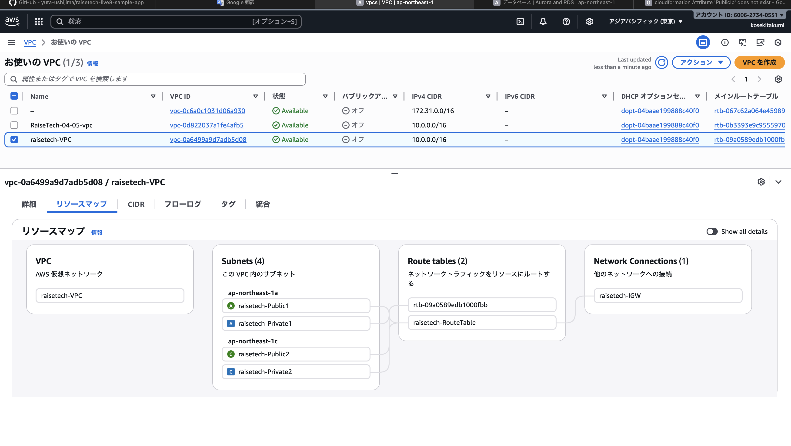
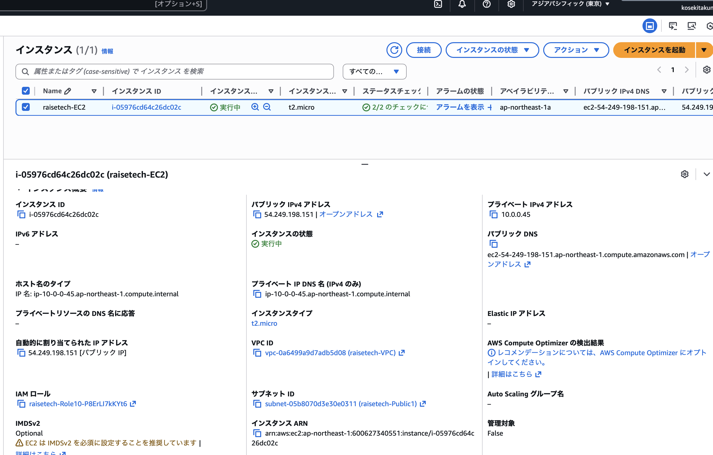
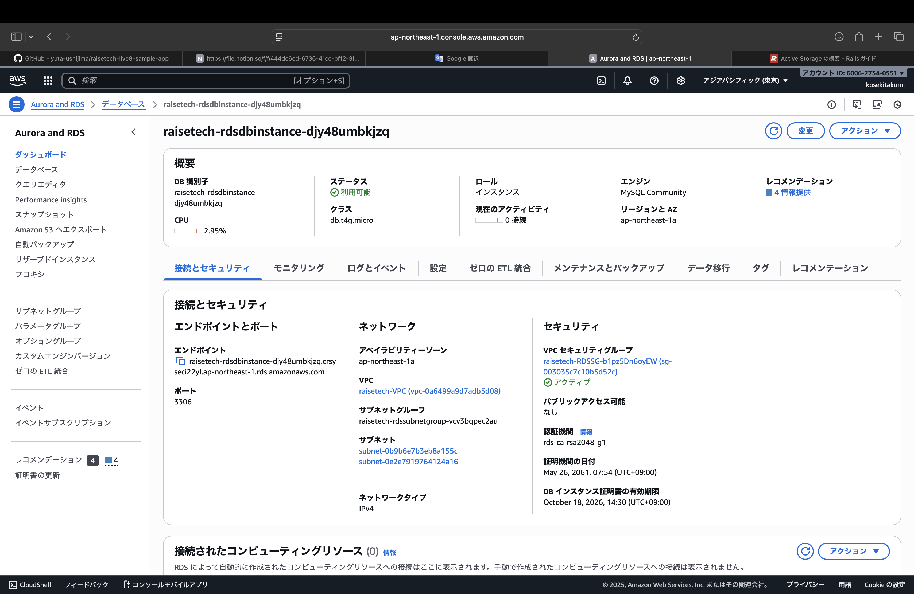
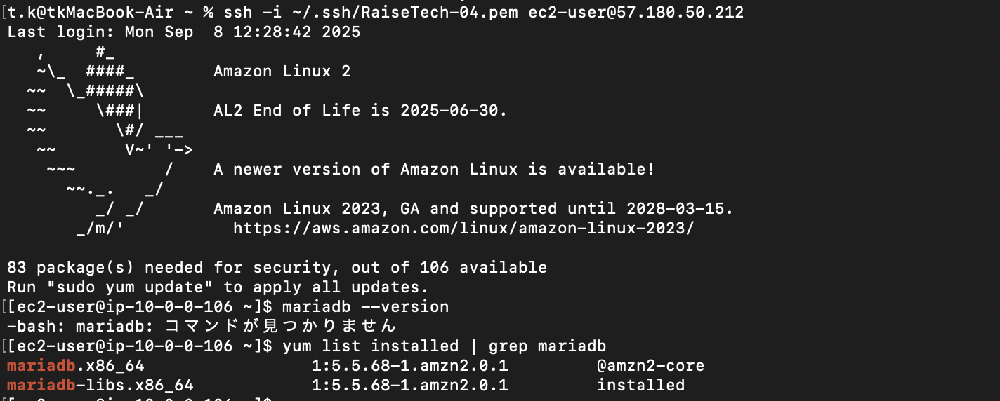
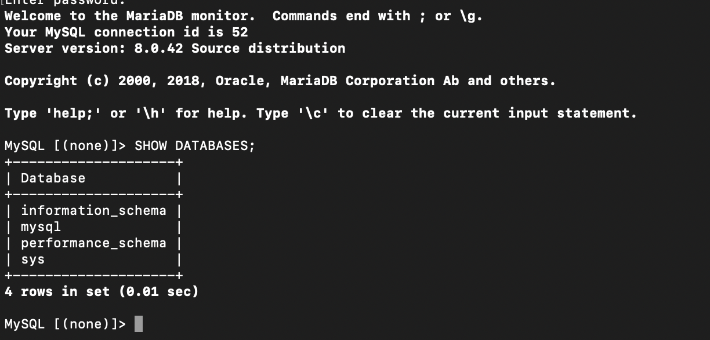
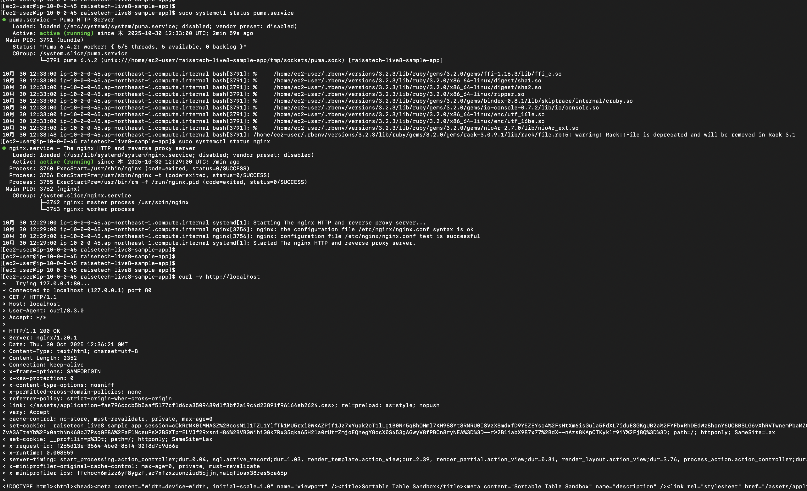
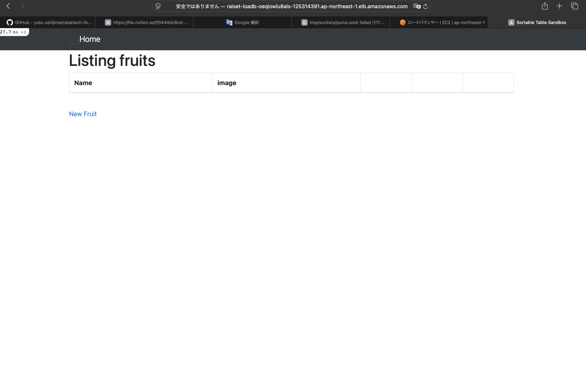
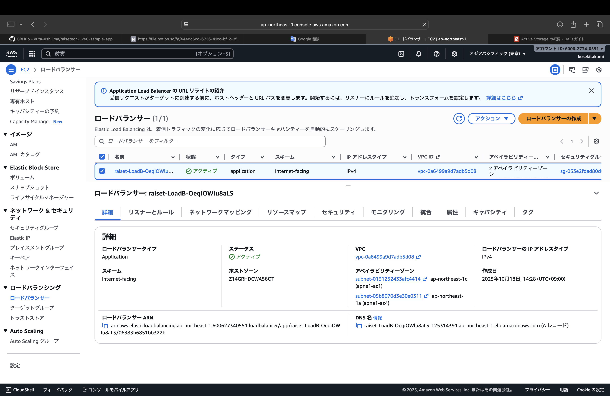
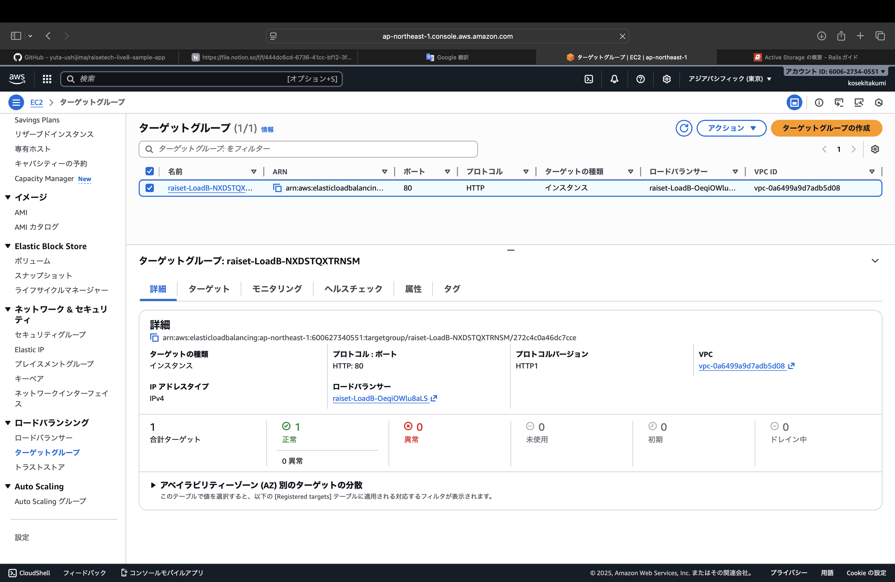
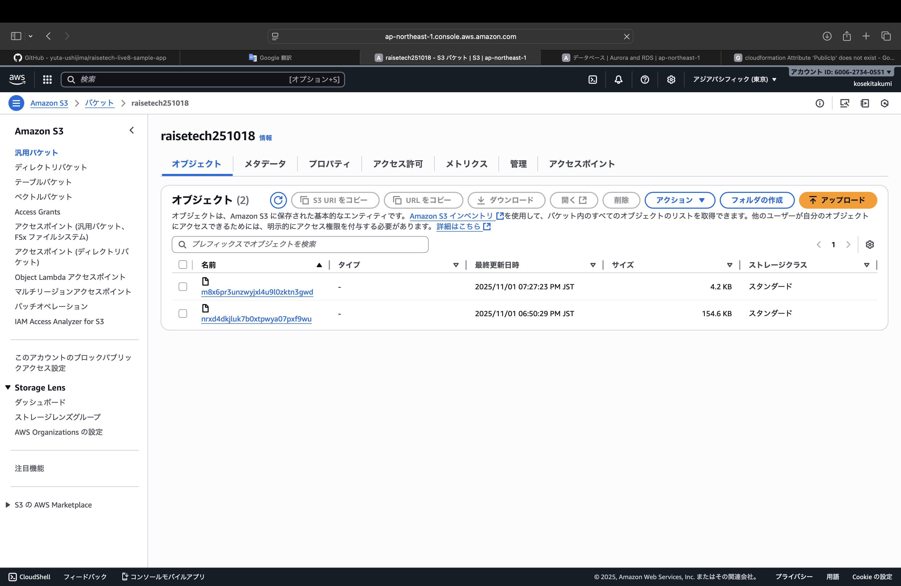

# 第10回課題

## 概要
* CloudFormation を利用して、第５回で作った環境をコード化する。
* 起動確認
* 発生エラーと対処
* 感想


## 1 . CloudFormation を利用して、第５回で作った環境をコード化する。
[作成したテンプレート](template.yml)

## 2 . 起動確認
* VPC / サブネット / ルートテーブル / インターネットゲートウェイ



* EC2



* RDS



* SSH接続




* RDS接続確認




* puma・Nginxの起動 / curlとブラウザでの接続確認





* ロードバランサー / ターゲットグループ





* S3バケット



## 3 . 発生エラーと対処 

### 〜 スタック更新時に起きたエラーと対処 〜

### ① Attribute 'PublicIp' does not exist　

EC2とRDSが起動していなかった事が原因。

### ② Circular dependency(循環参照)
 
 ALBとEC2で相互依存が起きていた。
 
  ALBアウトバウンド：!Ref EC2SG
  
  EC2インバウンド　： !Ref ALBSG　の設定がされており読み込めなかったことが原因。

  セキュリティグループはステートフルなのでアウトバウンドはインバウンドが許可されている限り自動で自動で許可される。


### 〜 デプロイ時のエラーと対処 〜

### nokogiriのエラー（version ‘GLIBC’ not found）

① Nokogiriにはバイナリー版とソース版があり、Bundlerによってバイナリー版がインストールされていた。
バイナリー版はGLIBCありきで作成されており、今回使用しているlinax2のGLIBCは古くバイナリー版を動かすのに対応していなかったのが原因でエラーが発生した模様。

```
Select gem to uninstall:
 1. nokogiri-1.16.5-x86_64-linux
 2. nokogiri-1.18.10
 3. nokogiri-1.18.10-x86_64-linux-gnu
 4. All versions
> ３
```
リストを見ると,バイナリー版とソース版の両方がインストールされており、一旦バイナリー版の３を削除して、エラーメッセージにあったコマンド（下記記載）を入力。
```
gem install nokogiri --platform=ruby
```
```
bundle config set force_ruby_platform true
```
その後
```
bundle install
```
で解決。

### Sprockets / webpacker　のエラー

### ② Sprockets::FileNotFound　（下記エラー文）
```
 Sprockets::FileNotFound: couldn't find file 'application' with type 'text/css' 
 ```
 app/assets/stylrsheets内に,
 ```
 application.css
application.scss
fruit.scss
```
が存在し、Sprocketはscssもcssも同じもの（application.css）と認識するので衝突した。
application.cssを削除し、fruit.scssをapplication.scssに@importして解決。

### ③ Sprockets::DoubleLinkError (下記エラー文)
```
Multiple files with the same output path cannot be linked ("application.css")
```

manifest.jsに 

```
//= link_tree ../stylesheets/css
//= link_tree ../build
```

が存在していた。上記のせいで、

sprocket側が
application.scssをapplication.cssに変換

webpacker側(ビルド)でapplication.cssを生成し、同一ファイル名が重複したことが原因。

stylesheetsのcssの行を消してsprocket側でcssに変換しないようにしたら解決。


## 4 . 感想
一度テンプレートを作ってしまえば、手作業でミスを起こしやすい部分も自動化ができ、毎回同じ構成が再現できるので非常に便利だと思いました。
その一方で、使い回しをしやすくするために、テンプレートのパラメーターやアウトプットなどを工夫して作成しなければならなく、覚える事も沢山あり、大変だと感じました。