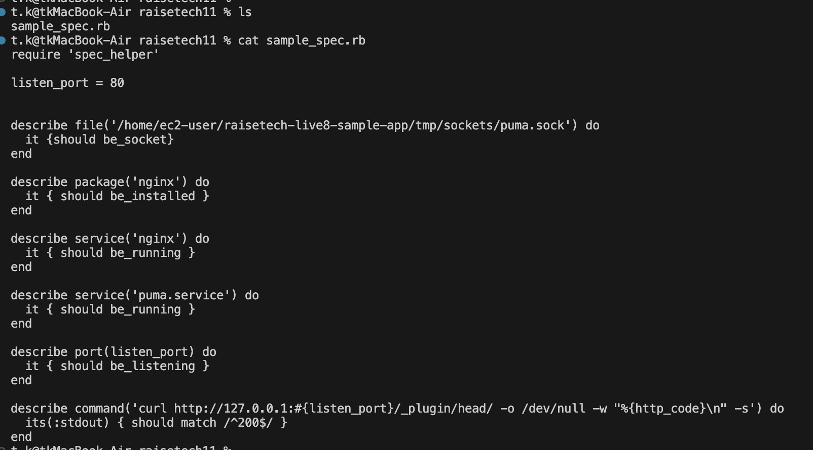
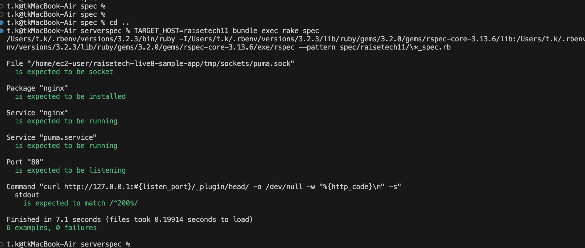

# 第11回課題

## 概要
* 第１０回で作成した構成でServerSpecのテストを成功させる。
* 発生したエラー内容
* 感想


## 1 . 第１０回で作成した構成でServerSpecのテストを成功させる。

### ServerSpecツリー構造 ※初期化でSSHを指定。

```
serverspec/
    ├──Gemfile　 　　　# bundle initで生成
    ├──Gemfile.lock 　# bundle install
    ├── Rakefile
    └── spec/
          ├── raisetech11/
          │       └── sample_spec.rb
          │ 
          └── spec_helper.rb


```

### spec_helper.rb


### sample_spec.rb



### .ssh/config


### テスト実行
ー 実行コマンド ー
```
TARGET_HOST=raisetech11 bundle exec rake spec
```

※ TARGET_HOST=(.ssh/config内に書いたhost名)を起動コマンドに含めると環境変数として代入され、.ssh/configに記載されたSSH設定のホスト名を探し、一致した場合SSH接続が実行される。



※ MACからSSHで実行したい場合は、

❶SSH情報をhelperに一本化（ホストが増えると設定が肥大化し管理が複雑になる恐れ有）

❷ローカルの.ssh/configとherperを連携する。

ローカルの.ssh/configにHostやHostnameや秘密鍵を埋め込む。


## 今回発生したエラー内容

* Net::SSH::AuthenticationFailed　のエラー

テスト実行を行うたびに、このエラーが発生。
原因として、初期化（servespec init）の時点でSSHを選択し、ローカルではなくEC2上でSSH接続をしようとしていた。かつ、秘密鍵がEC2に設置されていなかったためSSHがそもそもできなくてこのエラーを吐いていた。
＊SSHは接続元に秘密鍵（pem）、接続先に公開鍵が必要。
初期化の設定の部分でExecに変更後、テストが起動。


## 感想
第5回・第10回で時間をかけて手動で行なっていた起動テストを、sample.rbに記載を行うだけで、毎回同じテストを高速で、かつ、テスト漏れがなく行えるので非常に便利だと感じました。
これからもオリ回を深めていきたいと思います。

