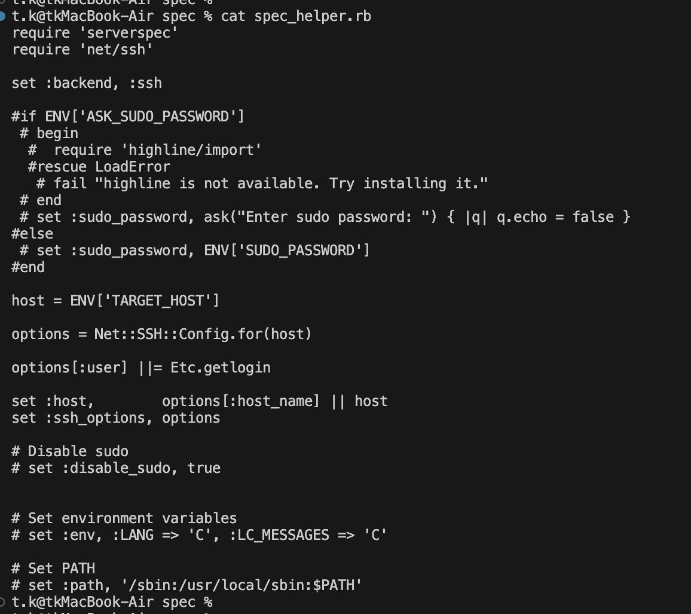
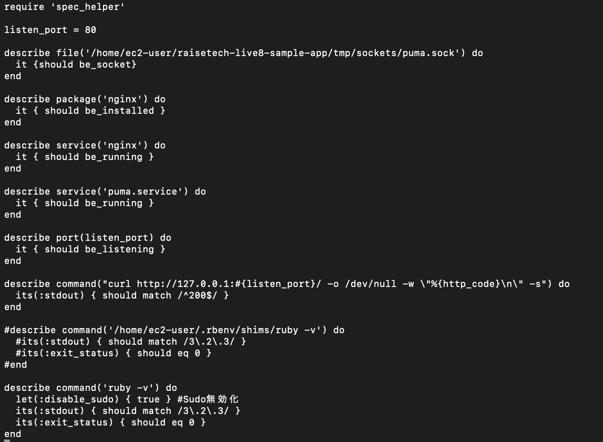
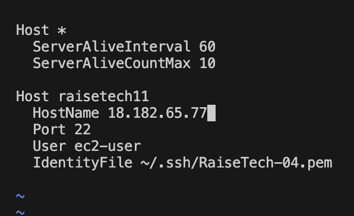
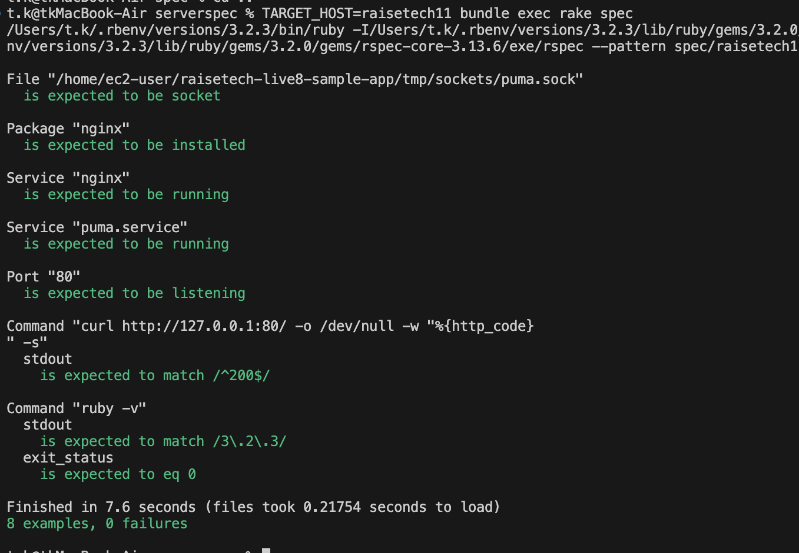

# 第11回課題

## 概要
* 第10回で作成した構成でServerSpecのテストを成功させる。
* 発生したエラー内容
* 感想


## 1 . 第10回で作成した構成でServerSpecのテストを成功させる。

### ServerSpecツリー構造 ※初期化でSSHを指定。

```
serverspec/
    ├──Gemfile　 　　　# bundle initで生成
    ├──Gemfile.lock 　# bundle install
    ├── Rakefile
    └── spec/
          ├── raisetech11/
          │       └── sample_spec.rb
          │ 
          └── spec_helper.rb
```

### spec_helper.rb



### sample_spec.rb

[作成したsample_spec.rbのコード](sample_spec.rb)



### .ssh/config




### テスト実行
ー 実行コマンド ー
```
TARGET_HOST=raisetech11 bundle exec rake spec
```

※ TARGET_HOST=(.ssh/config内に書いたhost名)を起動コマンドに含めると環境変数として代入され、.ssh/configに記載されたSSH設定のホスト名を探し、一致した場合SSH接続が実行される。


[テスト実行結果](test.txt)

※ MACからSSHで実行したい場合は、

❶SSH情報をhelperに一本化（ホストが増えると設定が肥大化し管理が複雑になる恐れ有）

❷ローカルの.ssh/configとherperを連携する。

ローカルの.ssh/configにHostやHostnameや秘密鍵を埋め込む。


## 今回発生したエラー内容

### 1. Net::SSH::AuthenticationFailed　のエラーについて

テスト実行を行うたびに、このエラーが発生。

原因として、初期化（servespec init）の時点でSSHを選択し、ローカルではなくEC2上でSSH接続をしようとしていた。かつ、秘密鍵がEC2に設置されていなかったためSSHがそもそもできなくてこのエラーを吐いていた。

※SSHは接続元に秘密鍵（pem）、接続先に公開鍵が必要。

ー　対処した方法　ー

初期化の設定の部分でExecに変更後、テストが起動。


### 2. sample.spec.rbの(ruby -v)command not foundになる問題について

サーバー環境では適切なrubyのバージョンがインストールされているにも関わらず、SSH経由でテストを実行すると、見つけられなくなる現象が発生。

原因として、テスト実行時にsudo でコマンドが実行されることで、通常のユーザー環境でのPATHが引き継がれず、上書きされてしまいPATHが見つけられなくなっていた。

※ ServerSpecのSSHバックエンドでは、基本root権限で各種コマンドが実行されるので、sudoでコマンドが動いていた。
したがって、ruby -vの部分もsudo実行されてしまい見つけることができなくなっていた。

ー　対処した方法　ー

```
describe command('ruby -v') do
  let(:disable_sudo) { true } #この行を追加（sudo無効化）
  its(:stdout) { should match /3\.2\.3/ }
  its(:exit_status) { should eq 0 }
end
```
ruby -v　の部分のみsudoの無効化を行った。

```
describe command('/home/ec2-user/.rbenv/shims/ruby -v') do
  its(:stdout) { should match /3\.2\.3/ }
  its(:exit_status) { should eq 0 }
end
```
また、別の方法として絶対パスでも対処可能。
## 感想
第5回・第10回で時間をかけて手動で行なっていた起動テストを、sample.rbに記載を行うだけで、毎回同じテストを高速で、かつ、テスト漏れがなく行えるので非常に便利だと感じました。
これからも理解を深めていきたいと思います。

また、「sudoは通常ユーザーのPATHは引き継がない」しっかり覚えました。

## 参考にしたサイト
[ServerSpec公式ドキュメント](https://serverspec.org/resource_types.html)

[Serverspecの導入の仕方](https://qiita.com/oh_4shiki/items/9439249781b5557a19b6)

[Serverspecでよく使うテストの書き方まとめ](https://qiita.com/minamijoyo/items/467ddd13c0cab15330bf)


