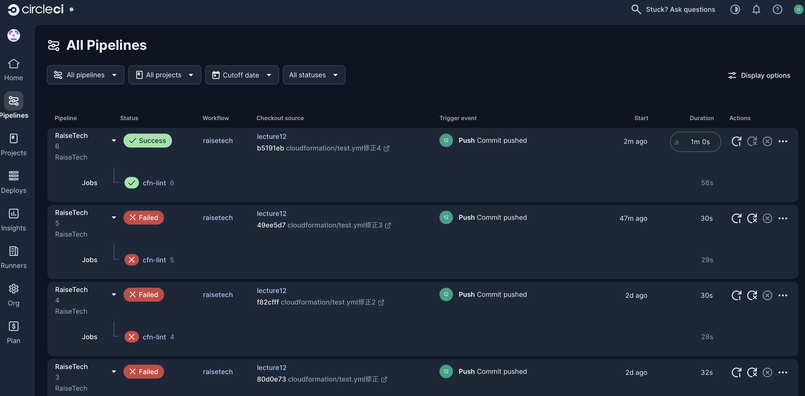
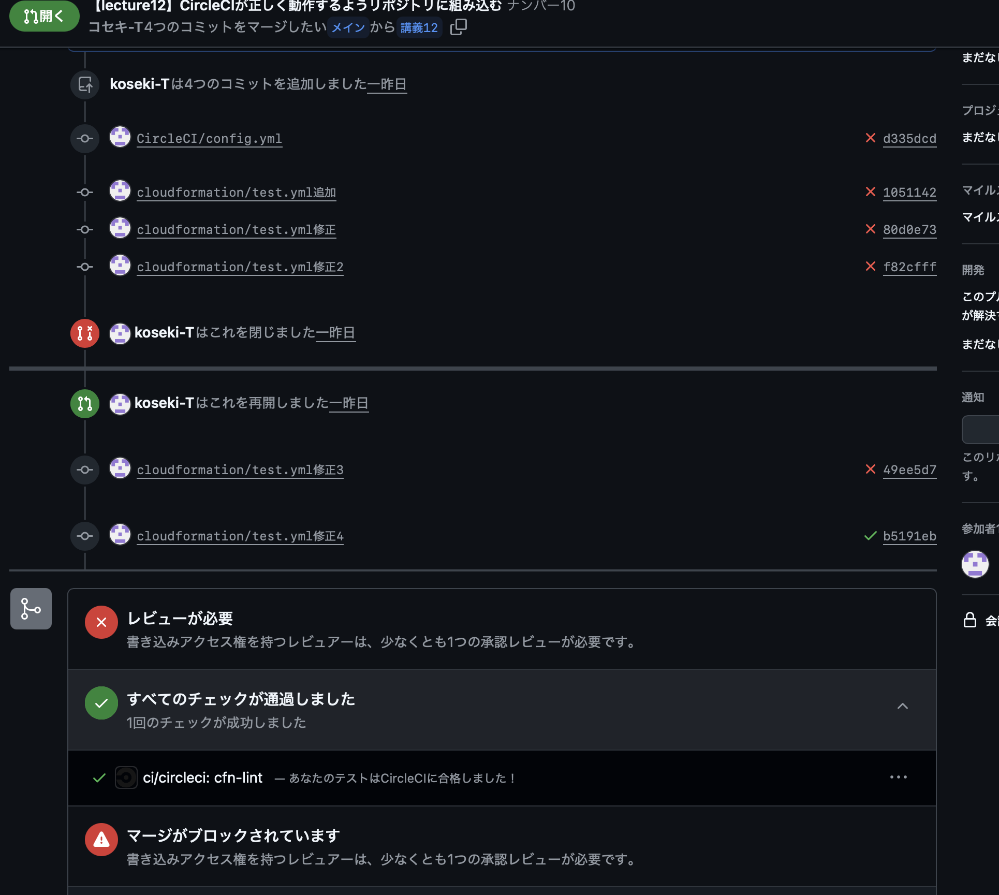

# 第12回課題

## 概要
* config.ymlを適切な位置に配置し、CircleCIを動作させる。
* CI/CDの理解。


## 1 . config.ymlを適切な位置に配置し、CircleCIを動作させる。

### ツリー構造 

```
RaiseTech/
    ├── lecture10/
    ├── lecture11/
    ├── lecture12/
    │  
    ├── cloudformation/
    │        └── test.yml
    │  
    └── .circleci/
             └── config.yml
```


### [config.yml](config.yml)を.CircleCIの下へ配置
①GitHubにpushした瞬間に、config.ymlの中身を元にCircleCIが自動でテストを実行する。

## CircleCI画面


## GitHub画面


## 2 . CI/CDの理解

### ー CI/CD ツール ー

### CI :継続的インテグレーション 

〜 pushした時点で自動でテスト実行される 〜
※ビルドとテストの自動化

### CD :継続的デリバリー ・ 継続的デプロイメント

継続的デリバリー : デプロイ直前まで自動化

継続的デプロイメント : デプロイまで自動化

〜 CIのテストに合格したコードをいつでもリリースできる状態にする仕組み 〜

※デプロイの自動化

