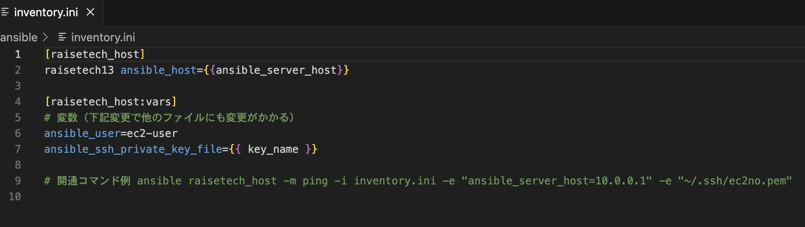
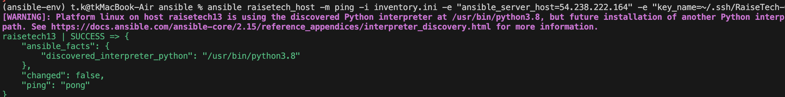
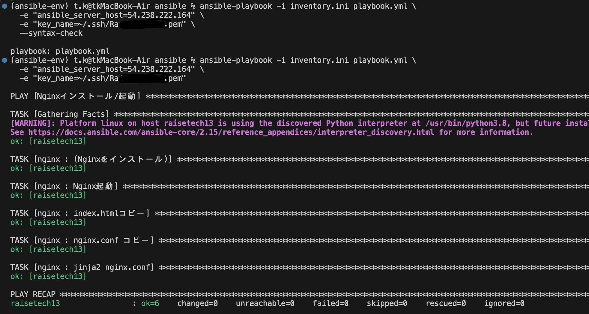
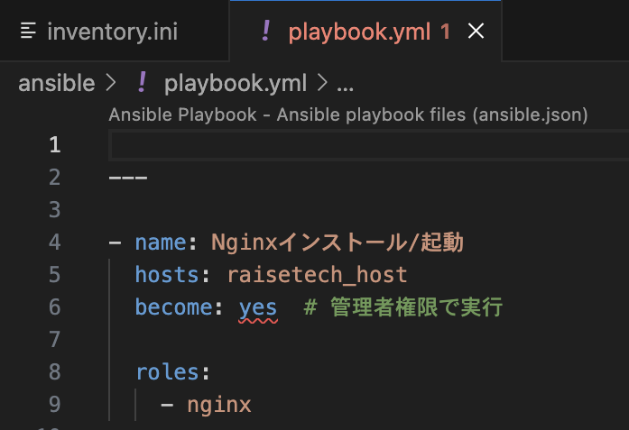
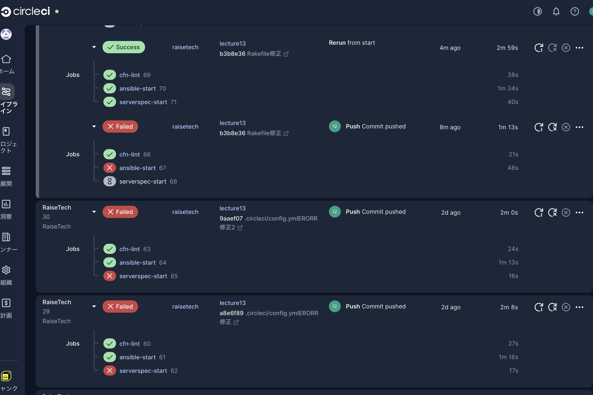
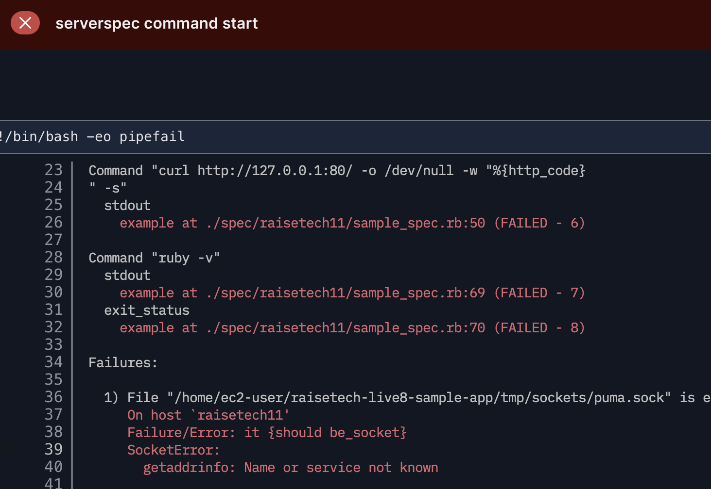
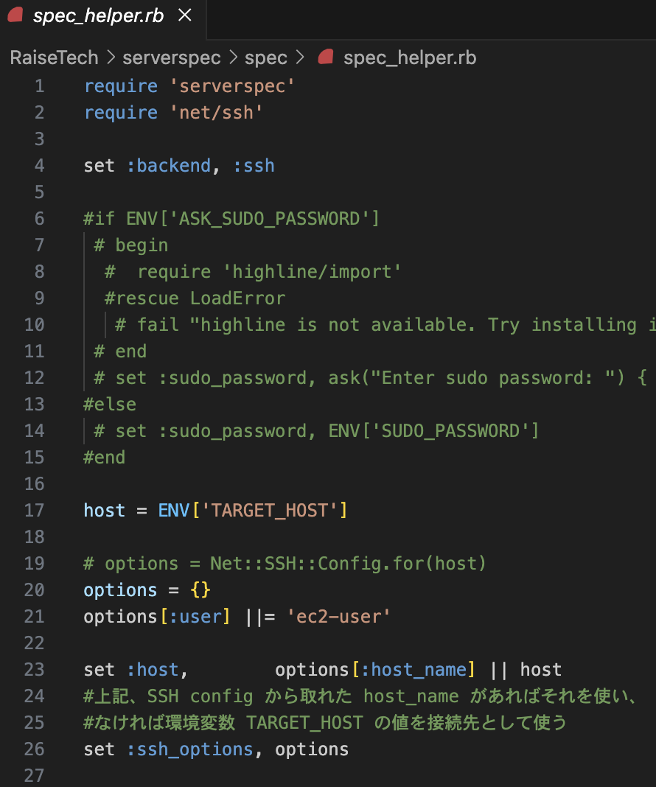
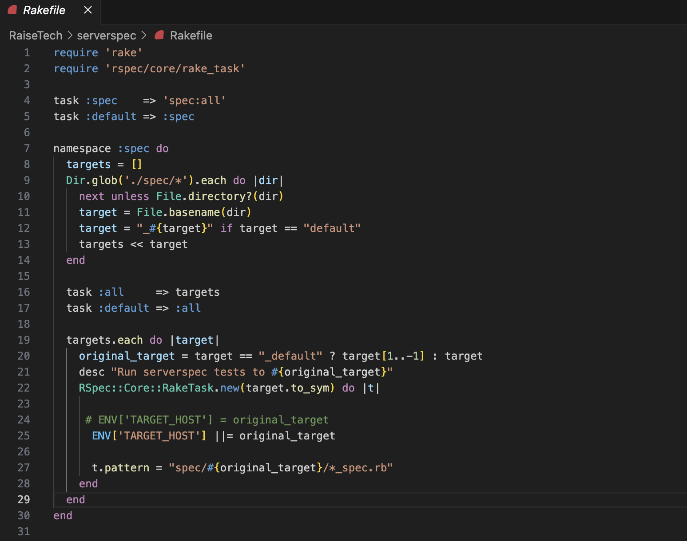

# 第13回課題

## 概要
* CircleCI config.ymlに ServerSpec や Ansible の処理を追加する。

CircleCIで以下の順に処理を実行する構成を作成。

1. cfn-lintでCloudFormationテンプレートを検証
2. Ansibleでサーバ構築
3. Serverspecで構築後の状態をテスト


## 1 . CircleCIでServerspecとAnsibleを実行するCI環境を構築


### [ansible/ inventory.ini](../ansible/inventory.ini)


### 疎通確認　　※playbookにtasks等一括記述済み


### 動作確認　　※playbookにtasks等一括記述済み


### 動作確認後、playbookをrolesに分割
```
ansible-galaxy init nginx

nginx/
 ├── README.md 
 ├── defaults 
 │ └── main.yml 
 ├── files 
 ├── handlers 
 │ └── main.yml 
 ├── meta 
 │ └── main.yml 
 ├── tasks 
 │ └── main.yml 
 ├── templates 
 ├── tests 
 │ ├── inventory 
 │ └── test.yml 
 └── vars
   └── main.yml
```
## tasks
### [ansible/ roles/nginx/tasks/main.yml](../ansible/roles/nginx/tasks/main.yml)
## templates
### [ansible/ roles/nginx/templates/nginx.conf.j2](../ansible/roles/nginx/templates/nginx.conf.j2)
## handlers
### [ansible/ roles/nginx/handlers/main.yml](../ansible/roles/nginx/handlers/main.yml)
## vars
### [ansible/ roles/nginx/vars/main.yml](../ansible/roles/nginx/vars/main.yml)
## playbook.yml
### [ansible/ playbook.yml](../ansible/playbook.yml)



## 以下.circleci/config.yml
### CloudFormation lint　→ Ansible(サーバー構築) → ServerSpec(サーバー検証)
```
version: 2.1 #バージョン2.1使用
orbs: #パッケージ（orbs）の中からPython2.0.3を使用
  python: circleci/python@2.0.3
  ruby: circleci/ruby@2.6.0

jobs: #jobの定義（初めの一回のみ） 
  cfn-lint: #jobの名前を設定
    executor: python/default #jobのstepが実行される実行環境を定義（Pythonのデフォルト環境指定）
    steps:
      - checkout #GitHubから情報取得
      - run: pip install cfn-lint #pip(Python用ツール)でcfn-lintをinstall
      - run:
          name: run cfn-lint #実行名を定義（無いと下のコマンドが名前になってみにくくなる）
          command: | #cloudformationフォルダ内の.ymlをテストさせるコマンド
            cfn-lint -i W3002 -t cloudformation/*.yml


  ansible-start: #jobの名前を設定
    executor: python/default #実行環境を定義
    steps: #作業手順
      - checkout #GitHubから情報取得
      - add_ssh_keys:
          fingerprints: #circleCIで登録済み
            - "SHA256:BbF/e4qEHi98IYbVJ7I55VRHsvmm0uEFxdHjsie0Y4g"
    
      - run: #pipでansibleinstall
          name: ansible install
          command: pip install ansible
 
      - run: #実行コマンド
          name: ansible command start
          command: |
            ssh-keyscan $RaiseTech13IP >> ~/.ssh/known_hosts

            ansible-playbook -i ansible/inventory.ini \
            -e "ansible_server_host=$RaiseTech13IP" \
            -e "key_name=/home/circleci/.ssh/id_rsa" \
            ansible/playbook.yml

#＝＝＝＝＝＝＝＝＝＝＝＝＝＝＝＝＝＝＝＝＝＝＝＝＝＝＝＝＝
  serverspec-start:
    docker:
      - image: cimg/ruby:3.2.3 #ruby3.2.3が入ったdockerを使用
    #executor: ruby/default ※defaultのrubyが古くbundlerが動かなかったので上記に変更した。
    steps: #作業手順
      - checkout #GitHubから情報取得
      - add_ssh_keys:
          fingerprints: #circleCIで登録済み
            - "SHA256:BbF/e4qEHi98IYbVJ7I55VRHsvmm0uEFxdHjsie0Y4g"
    
      #- run: #gemでserverspec install
      #    name: serverspec install
      #    command: gem install serverspec

      #- run: #gemでrake install
      #    name: spec install
      #    command: gem install rake

      - ruby/install-deps: #bundle installをしてくれる
          app-dir: serverspec

      - run: #実行コマンド
          name: serverspec command start
          command: |
            ssh-keyscan ${RaiseTech13IP} >> ~/.ssh/known_hosts

            cd serverspec

            TARGET_HOST=${RaiseTech13IP} bundle exec rake spec
            

 #=================================================           

workflows: #jobとその実行順序を定義する場所
  raisetech: #ワークフロウの名前を設定
    jobs:
      - cfn-lint
      - ansible-start:
          requires:
            - cfn-lint

      - serverspec-start:
          requires:
            - ansible-start
```
※ TARGET_HOST=${RaiseTech13IP} はCircleCiの環境変数にて設定

※ EC2に接続するため、秘密鍵をCircleCiのフィンガープリントとして設定

※ ServerSpecは以前作成したファイルを使用



## 今回発生したエラー内容

### 1. ServerSpec実行時、hostが意図しない値に書き換えられるエラー
実行コマンドにて、TARGET_HOST=${RaiseTech13IP} でIPアドレスを流しているにもかかわらず、ファイル名のraisetech11(serverspec/spac/raisetech11/spec.rb)がhostになってしまった。



## 解決方法
Rakefileの下記の部分が原因。
```
 ENV['TARGET_HOST'] = original_target
```
下記修正を行うことにより、TARGET_HOST環境変数が上書きされていた問題が解消。
```
ENV['TARGET_HOST'] ||= original_target
```
## [spec_helper.rb](../serverspec/spec/spec_helper.rb)

## [Rakefile](../serverspec/Rakefile)
