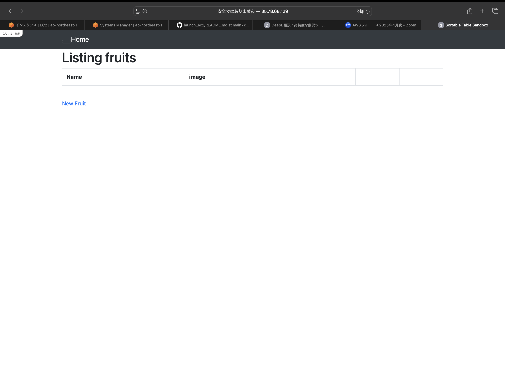
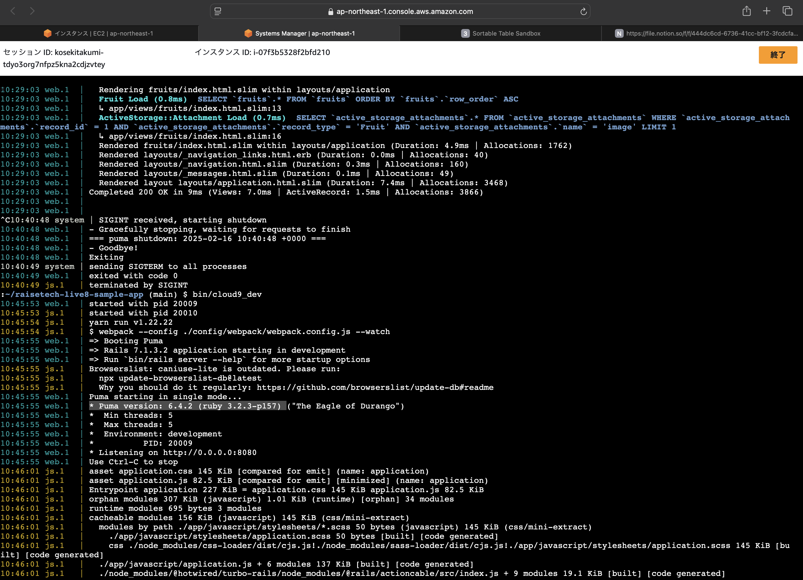
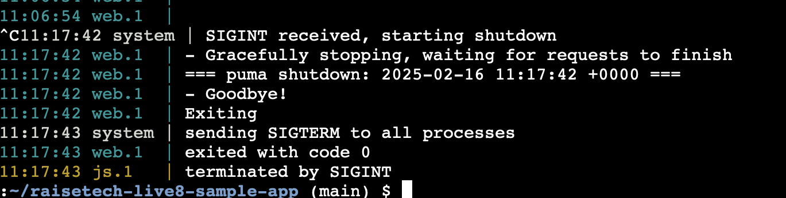
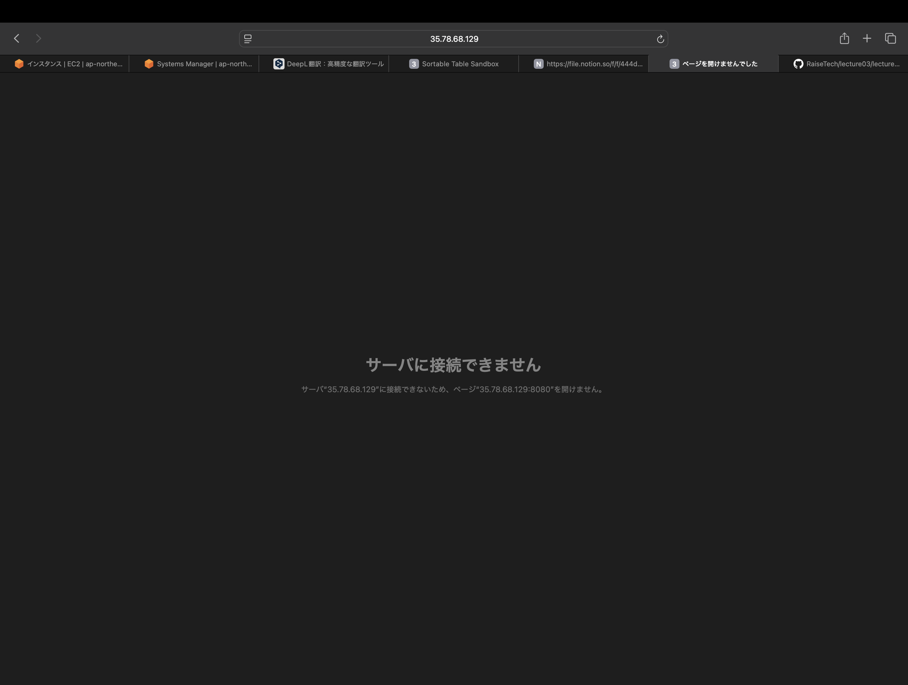
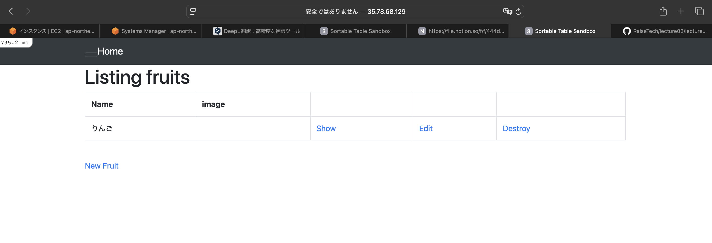
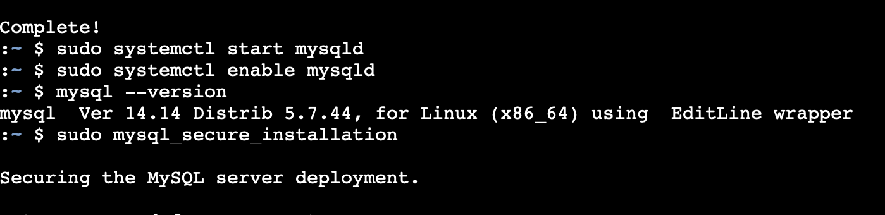
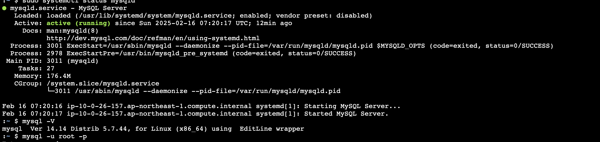
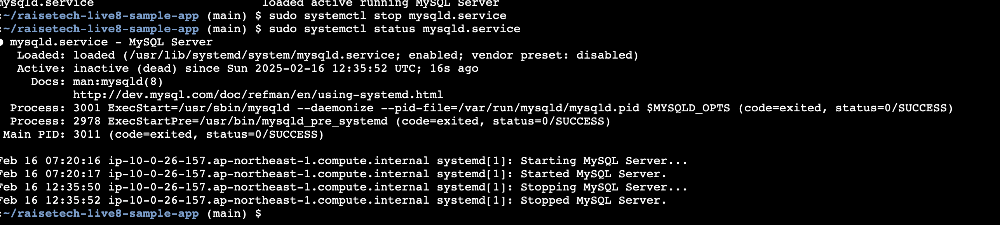
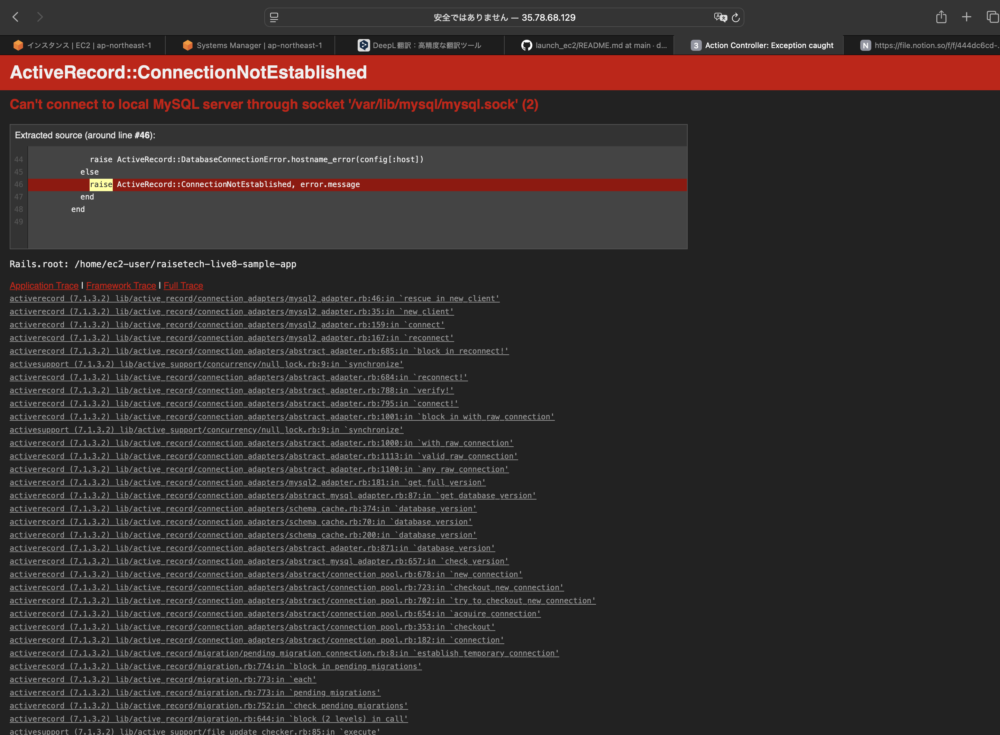
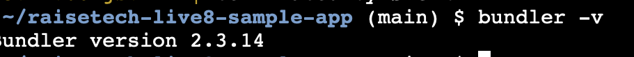

# 第3回課題

## サンプルアプリケーションの起動・ブラウザで接続確認

* 起動

* ブラウザでアクセス

## APサーバーの名前とバージョンの確認
* puma / バージョン6.4.2

### APサーバーを終了させた場合引き続きアクセスできますか？
* 出来ません。

* APサーバー再起動・りんごを追加

## サンプルアプリケーションで使用したDBエンジン・バージョンの確認
* MYSQL / バージョン5.7.44

### DBサーバーを終了させた場合引き続きアクセスできますか？
* 出来ません。

## Rails構成管理ツール名前
* Bundler

## 第3回課題感想
* エラー文には解決のヒントが書かれているので、チャットGPTにすぐ頼らずエラー文の翻訳と用語の理解をめんどくさがらずにこれからも行なっていこうと思いました。

