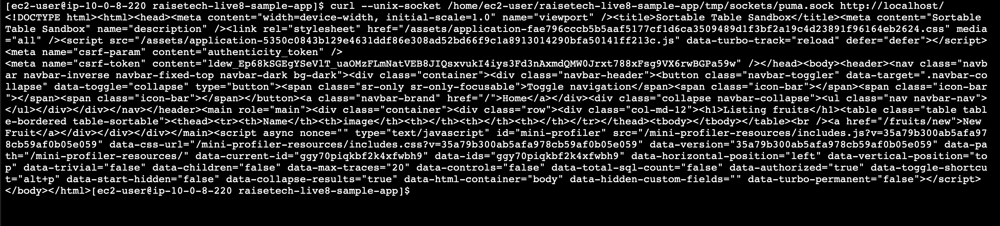
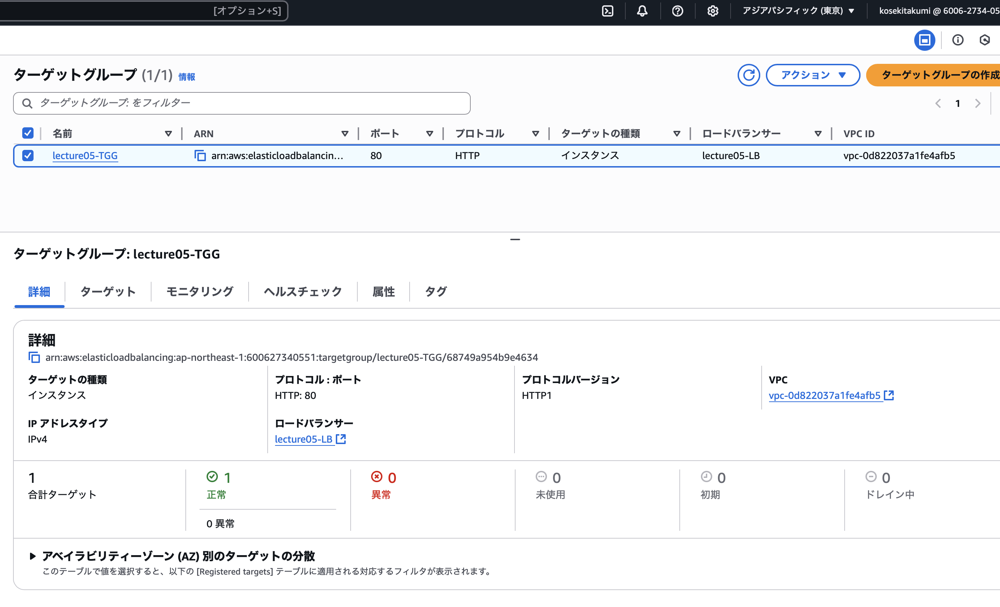

# 第五回課題

## 概要

* 組み込みサーバー(Puma)のみで起動。

* 組み込みサーバーとUnix Socketを使ったRailsアプリの動作確認。

* Nginxの単体起動確認。

* Nginxと組み込みサーバー、Unix Socketを組み合わせて、Railsアプリケーション動作確認を行う。

* ALBの追加。

* S3の追加。

* 構成図の作成。

## 1. 組み込みサーバー(Puma)のみで起動
### パブリックIPアドレスと3000番ポートでアクセスを行う。


## 2. 組み込みサーバーとUnix Socketを使ったRailsアプリの動作確認
### puma.rbに記載を行う。
* TCP通信をコメントアウト。
* リッスン設定をUnix Socketに変更。


### curlコマンドを使用し,動作確認を行う。

``` 
curl --unix-socket /home/ec2-user/raisetech-live8-sample-app/tmp/sockets/puma.sock
```



【メモ】PumaがUnix socketで起動している場合、ブラウザから直接アクセスするためには、NginxやApacheなどのリバースプロキシが必要となる。これらがない場合での起動確認は、curlコマンド使用する。

## 3.Nginxの単体起動確認
### yumでNginxをインストール。

```
sudo yum -y install nginx
```

### Nginx起動
```
sudo systemctl start nginx
```


## 4.Nginxと組み込みサーバー、Unix Socketを組み合わせて、Railsアプリケーション動作確認を行う。
* ```/etc/nginx/nginx.conf.d```を修正しNginx再起動。
* Puma再起動。


### ブラウザでの確認


## 5.ALBの追加
### ターゲットグループ作成・ヘルスチェック設定



### ロードバランサー作成


### DNS名を使用しブラウザでアクセス


## エラー発生
Blocked hostsエラーが発生したので、
```config/environments/development.rb```へ

`
config.hosts « "lecture05-1b-1580245885.ap-northeast-1.elb.amazonaws.com"`の記載を行う。


## 6.S3の追加

* バケット作成。
* EC2にS3フルアクセス権限のIAMロール権限を付与。
* storage.ymlの編集。 (S3 /リージョン/バケット名入力)
* development.rbの編集。（active storageをamazonに指定）
* active storageをインストール。
### バケット作成


ブラウザ内で画像をアップロードをし、バケットに反映できているかを確認。


※上記、アップロードした画像が、反映されないエラーが発生。

バケットとの連携は完了。

## エラー発生　　


アプリケーションでアップロードした画像がブラウザで表示されないので、
調べていくとlibvipsが不足していることが判明。

　
※libvips：画像リサイズするライブラリ。

【解決した方法】
* Remiリポジトリをインストール。

```
sudo yum install http://rpms.remirepo.net/enterprise/remi-release-7.rpm
```

* Remiリポジトリからvipsを探してインストール。
```
sudo yum install vips --enablerepo=remi
```


無事、画像反映完了。

## 7.構成図


## 感想
課題を進めていく上で、上記の他以外にも、たくさんのエラーが発生しました。

* Nginx 404エラー
* Nginx 502エラー
* development.rbにホスト名を記載　RailsのHost Authorization設定
* ALBのUnhealthy、Request timed out）※RDS未起動が原因。

一つのエラーを解決するために、かなりの時間を要してしまったので、早く解決できるよう、引き出しや、論理的思考を身につけなきゃなと考えさせられました。

これらエラーを早期解決するために、作業の切り分けをし、どこからどこまでがエラーが起きているかを推測しやすくする作業方法は非常に重要だと感じました。

