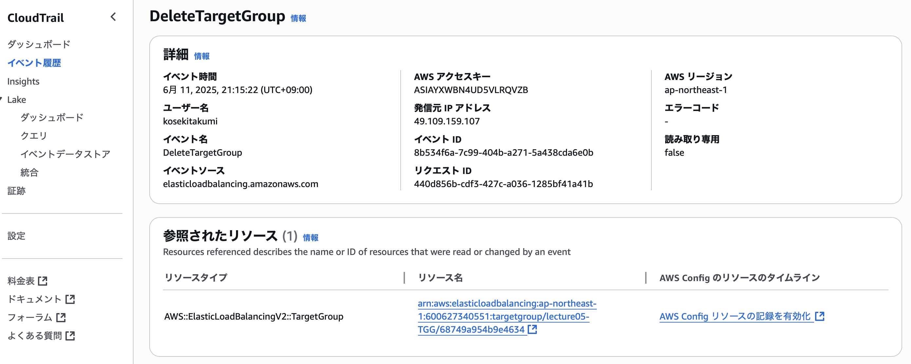
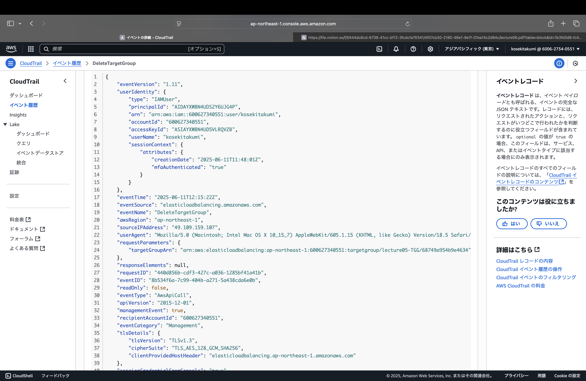
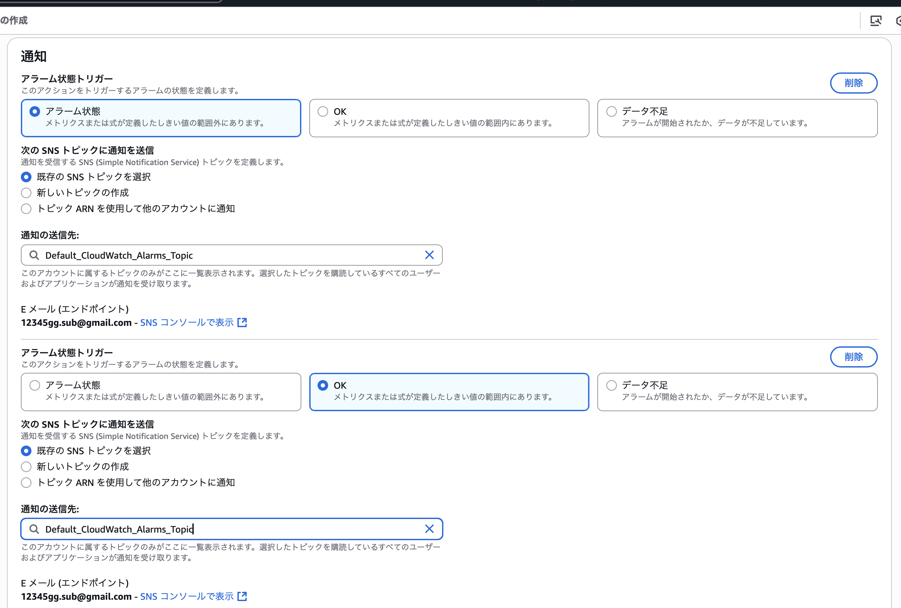
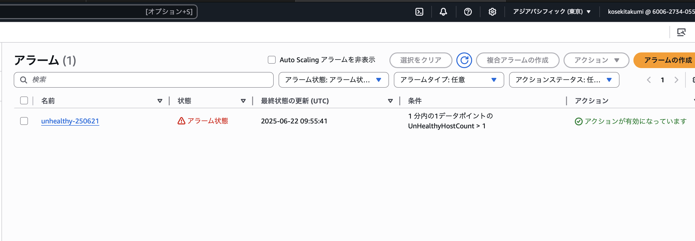
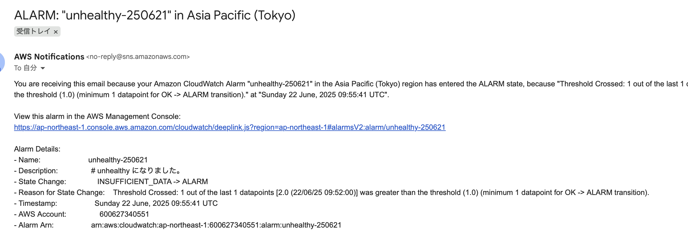
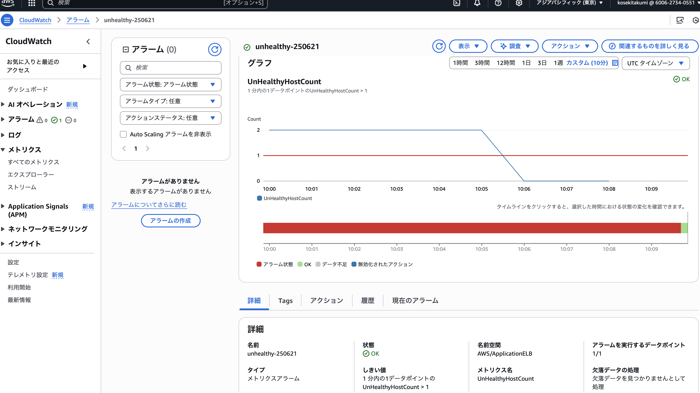
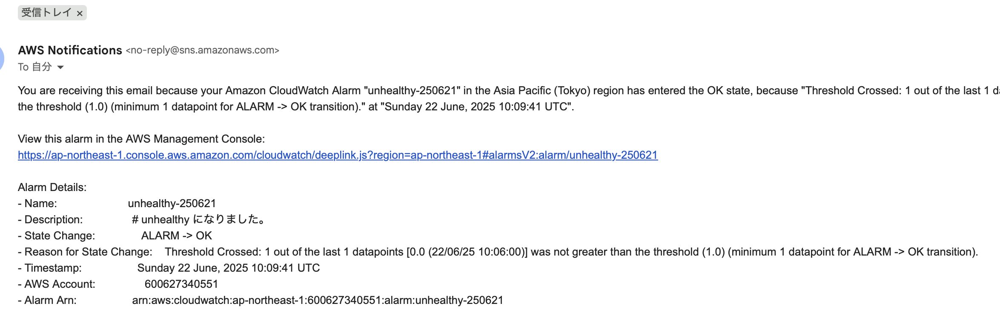
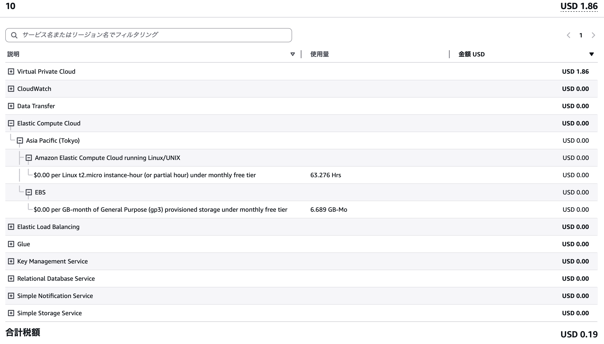

# 第6回課題

## 概要
* CloudTrail のイベントからAWSの利用記録を３つ読み取る。

* CloudWatchを利用し、ALBのアラーム/メール通知設定を行う。
　
* 学習で使用したAWSリソース内容の見積もりを行う。

* 現在の利用料を確認。


## 1 . CloudTrail のイベントからAWSの利用記録を３つ読み取る。




### ・ userIdentityの部分より確認
　ユーザーネーム：kosekitakumi /
IAMユーザーで実行したことがわかる。

### ・ eventName　eventTime　requestParametersより確認
2025.6.11にターゲットグループを削除したことがわかる。　
```
arn:aws:elasticloadbalancing:ap-northeast-1:600627340551:targetgroup/lecture05-TGG/68749a954b9e4634
```
### ・ awsRegionより確認
リージョンはap-northeast-1ということがわかる。
　　

## 2 . CloudWatchを利用し、ALBのアラーム/メール通知設定を行う。
・トピック（送り先設定）を作成し、アラーム/OKアクションの作成を行う。


### ①実際にPumaを止めてみる。

### ②アラーム通知を確認。

### ③Pumaを復帰させてみる。

### ④OKアクションの通知を確認。



## 3 . 学習で使用したAWSリソース内容の見積もりを行う。

[AWS見積もり](https://calculator.aws/#/estimate?id=9290ce016528a2d1e30db172cf14c6bf8628d863)


## 4 . 現在の利用料を確認。


## 感想
トラブルシューティングの基本となるAWSの証跡・ロギングを残すということは、自分やチーム、顧客やシステムを守ることにもつながるのでエンジニアにとって重要なことであることがわかりました。